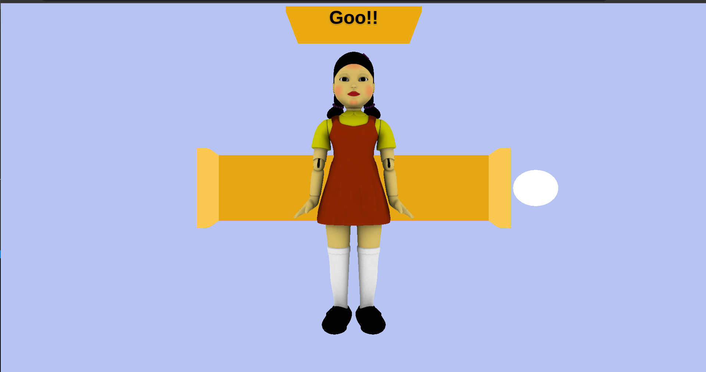

# Squid Game
## Red Light Green Light
Here I implemented a simple but interesting squid game with help from FreeCodeCamp. This is Simple game based of on a popular Netfilx seires called "Squid Game".

### Game Rules 
- Please note, its only works in Laptop / Desktop Browsers.
- To move forward , use Keyboard Up-Arrow Key only.
- Progress Bar is showing in the top of the screen. Complete the game before the timeout happens.

### Stacks used :
- [Three.js for 3D](https://threejs.org/)
- [GLTFLoader.js for Model](https://github.com/mrdoob/three.js/blob/dev/examples/js/loaders/GLTFLoader.js)
- [GSAP for Animation](https://greensock.com/gsap/)

### Credits
- [Freecodecamp](https://www.freecodecamp.org/)
- [Model - SketchFab](https://sketchfab.com/3d-models/squid-game-giant-doll-7afd49dd07714651a6afa1fc4aac8576)
